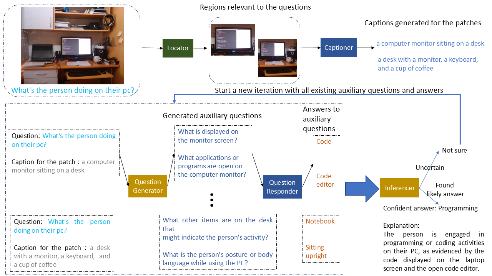

# Grounded Multi-modal Conversation for Zero-shot Visual Question Answering

### Overview

GMC-VQA is a region-grounded, conversation-based framework for zero-shot visual question answering. It combines a vision-language model (VLM) with a large language model (LLM) and uses grounding to focus on image regions relevant to a question. The system iteratively gathers region-specific visual evidence and synthesizes it to produce accurate answers, improving over end-to-end VLMs and prior LLM–VLM conversational methods.



<sub><em>Figure: GMC-VQA pipeline. The grounding module (Locator) identifies regions of interest based on the question. An iterative LLM–VLM conversation is conducted per region to collect targeted visual evidence, which the LLM (Inferencer) integrates to produce the final answer.</em></sub>

### Highlights

- Region-grounded multi-modal conversation between an LLM and a VLM
- Per-region iterative querying to collect targeted visual evidence
- Measurable gains across VQAv2, OK-VQA, and ST-VQA


## Installation

1. Create a new Python environment using the following command:

    ```bash
    conda env create -f environment.yml
    conda activate gmcvqa
    ```

2. Install Grounding DINO as specified in its [repository](https://github.com/IDEA-Research/GroundingDINO). Set the configuration path and the downloaded weights path in `./chat/grounding_dino.py`.

3. If you would like to use InstructBLIP, download its weights from [Hugging Face](https://huggingface.co/Salesforce/instructblip-flan-t5-xl) and set its path in `./lib/instructblip_lib.py`.

4. If you would like to use LLaVA, clone its [repository](https://github.com/haotian-liu/LLaVA) and set the path to the cloned directory in `./lib/llava_lib.py`.

## Dataset

In our paper, we conduct experiments on the following datasets: [VQAv2](https://visualqa.org/), [OK-VQA](https://okvqa.allenai.org/), and [ST-VQA](https://rrc.cvc.uab.es/?ch=11). Please download these datasets and organize their directories to follow the structure outlined below:

```
datasets/
    vqav2/
        Annotations/
            v2_mscoco_train2014_annotations.json
            v2_mscoco_val2014_annotations.json
        Images/
            mscoco/
                train2014/
                val2014/
        Questions/
            v2_OpenEnded_mscoco_train2014_questions.json
            v2_OpenEnded_mscoco_val2014_questions.json
    okvqa/
        Annotations/
            mscoco_train2014_annotations.json
            mscoco_val2014_annotations.json
        Images/
            train2014/
            val2014/
        Questions/
            OpenEnded_mscoco_train2014_questions.json
            OpenEnded_mscoco_val2014_questions.json
    stvqa/
        Annotations/
            test_task_3.json
            train_task_3.json
        Images/
            test/
            train/
```

## Run

Run GMC-VQA using the following command:

```bash
python main.py  \
    --data_root=/your/dataset/path \
    --exp_tag=experiment1 \
    --dataset=vqav2 \
    --device_id=0 \
    --vqa_model=blip2_t5_xl  \
    --openai_key=<your_openai_key> \
    --model=gpt4o_mini
```

## Evaluation

Use `evaluate_result.py` to perform automatic evaluation:

```bash
python evaluate_results.py  \
    --exp_tag=experiment1 \
    --dataset=vqav2 \
    --openai_key=<your_openai_key>
```

## Prompts

The prompts used in our framework are available under `./prompts`. These prompts are designed to guide the Question Generator and Inferencer modules as well as the performance evaluator.

Please refer to [PROMPTS.md](PROMPTS.md) to view images of the prompts.

## Citation

If you find this repository helpful, please cite the GMC-VQA paper (IEEE SMC 2025):

```bibtex
@inproceedings{gmc_vqa_2025,
  title     = {Grounded Multi-modal Conversation for Zero-shot Visual Question Answering},
  booktitle = {Proceedings of IEEE SMC},
  year      = {2025}
}
```